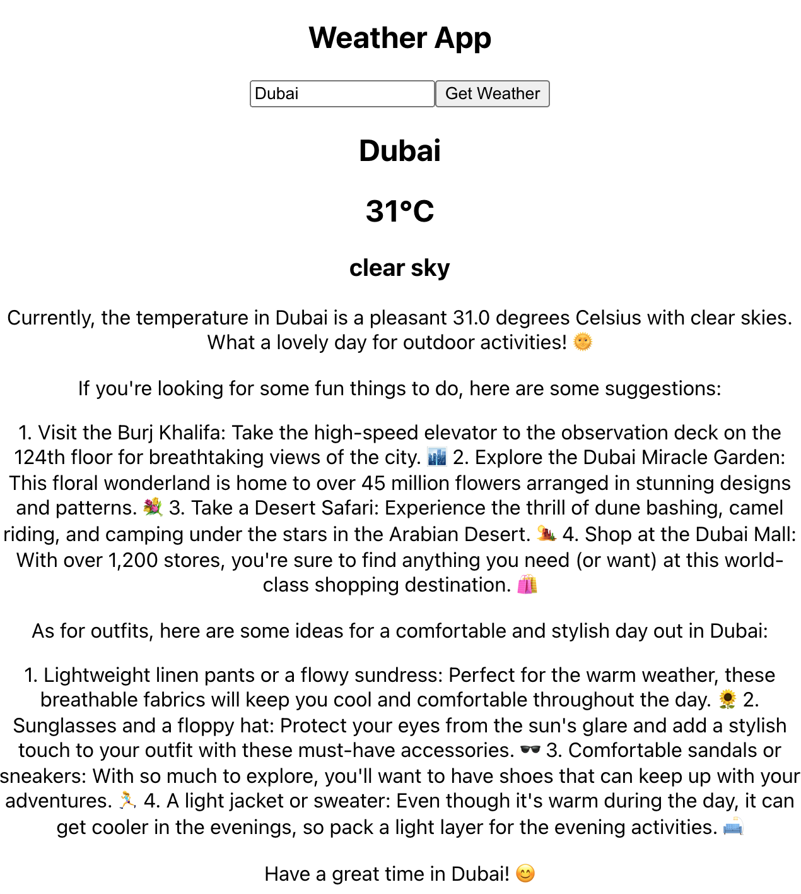

# weather-chat-fastapi
The application will retrieve weather data for a specified city and employ a generative language model to create an amusing summary of the weather, alongside providing suggestions for activities and outfits according to the current weather conditions.


# Weather API

This is a simple weather API that provides current temperature and weather data for a given city using the OpenWeatherMap API and generates a descriptive response using an LLM API.

## Backend 

Python FastAPI backend for weather data API.

## Requirements

- Python 3.10+
- Required Python packages are listed in requirements.txt

## Usage

Set environment variables

add your API keys to `.env`:

```
OPENWEATHER_API_KEY=YOUR_OPENWEATHER_API_KEY
LLM_API_KEY=YOUR_LLM_API_KEY  
```

The `start.sh` script can be used to run the application:

```bash
./start.sh
```

This will:

- Create a Python virtualenv 
- Install dependencies
- Start the uvicorn server

The application will then be accessible at http://localhost:8000

## Running manually

You can also run the application manually:

1. Create and activate virtualenv

```bash
python3 -m venv .venv
source .venv/bin/activate
```

2. Install dependencies

```bash 
pip install -r requirements.txt
```

3. Start server

```bash
uvicorn main:app --reload
```

## API Reference

### Get weather

```
GET /weather/{city} 
```

Parameters:

- `city` - City name

Response:

```json
{
  "temperature": 20,
  "description": "light rain",
  "generation": "Here is a descriptive response for the weather in London..."  
}
```

## Testing

Run tests with:

```bash  
pytest
```


# Weather App

### Frontend

React frontend application for viewing weather. 

## Usage

Run the frontend React app: 

```bash
./startapp.sh
```

This will start the Weather App on http://localhost:3000.

The React app makes requests to the backend WEATHER API for weather data.

### Weather App Screenshot


## Running Manually

### Frontend

```bash
cd frontend/app
npm install
npm start
```

## License

This project is licensed under the MIT License - see the [LICENSE](LICENSE) file for details.

Let me know if you need any changes to the Markdown formatting!